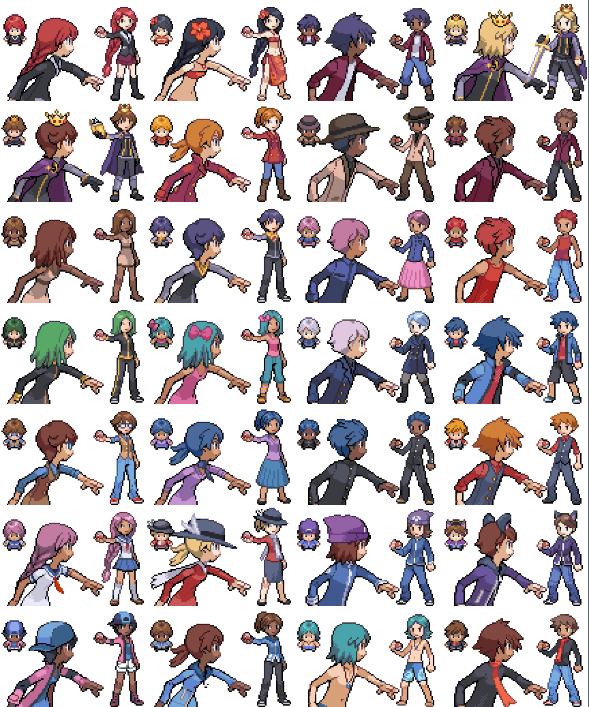

# Pokémon Pixel Avatar Creator

Criador de avatar independente em HTML, CSS e JavaScript. Esta versão usa o mesmo motor de montagem do Avatar Creator do site Pokémon Bless, mas não inclui Supabase, autenticação, perfil de membro, rotas ou qualquer outra integração do site.



## Recursos

- Interface atualizada e responsiva para desktop e celular.
- Prévia de `Frente`, `Ícone`, `Costas`, `Andando`, `Correndo` e `Bike`.
- Montagem automática de todas as visões a partir de uma única combinação.
- Seleção de corpo, roupa, cabelo, chapéu, acessórios e variações de cor.
- Cenários em pixel art aplicados à prévia e ao PNG baixado.
- Salvamento opcional no `localStorage` do próprio navegador.
- Exportação do PNG exibido e das imagens originais de cada sprite sheet.
- Suporte a movimento reduzido, navegação por teclado e layout mobile com prévia fixa.

Nenhum dado é enviado para o site ou para um banco de dados.

## Como usar

Abra `index.html` no navegador. O JavaScript e o manifesto já estão empacotados no projeto, sem dependências externas e sem etapa de build.

Se o navegador limitar downloads ao abrir arquivos locais, execute um servidor estático na pasta:

```bash
python -m http.server 8765
```

Depois acesse `http://localhost:8765`.

## Downloads

- **Baixar PNG**: baixa a visualização atualmente aberta, incluindo o cenário escolhido.
- **Exportar arquivos de sprite**: abre os downloads individuais de Frente, Ícone, Costas, Andando, Correndo e Bike.
- **Salvar no navegador**: guarda a combinação atual apenas neste navegador.
- **Redefinir**: restaura a última combinação salva no navegador.
- **Criar aleatório**: gera uma nova combinação válida com os assets disponíveis.

## Estrutura

```text
.
|-- index.html
|-- styles.css
|-- app.js
|-- manifest.json
|-- ui-icons/
|-- assets/
|   |-- backgrounds/
|   |-- front/
|   |-- back/
|   |-- walk/
|   |-- run/
|   `-- bike/
`-- docs/
    `-- GITHUB_PAGES.md
```

## Créditos dos assets

Os sprites base vieram do recurso **Trainer battlers - Character Customization Resources (Gen 4)**, publicado no Eevee Expo:

https://eeveeexpo.com/resources/317/

Crédito do recurso original: **Coffee Cup / Poltergeist**.

Os fundos de batalha vieram do post **Usable Battle background**, publicado por **CDRX73** no Reddit:

https://www.reddit.com/r/PokemonROMhacks/comments/1rlawqy/usable_battle_background/

Antes de publicar novos assets, mantenha os créditos e confira as permissões do material adicionado.
